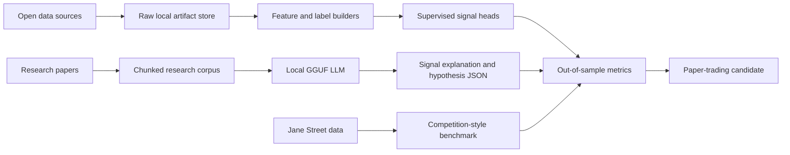
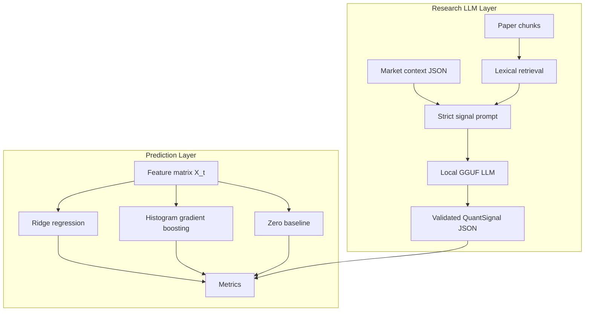

# Quant Research LLM Workspace

Local-first quantitative finance research stack for market prediction, paper trading research, Jane Street-style benchmarking, and a retrieval-augmented local LLM research assistant.

This repository is intentionally not a generic chatbot project. The language model is the research interface: it retrieves papers, explains signals, proposes hypotheses, and produces structured JSON signal arguments. The measurable trading signal is produced and judged by supervised market models, time-ordered validation, and competition-style metrics.

## Abstract

The project builds a reproducible local machine learning workspace for quantitative trading research under three constraints:

1. market claims must be scored out of sample;
2. research explanations must be grounded in local papers and datasets;
3. large language models must be local, quantized, and treated as reasoning wrappers rather than unverified trading engines.

The current stack combines Hugging Face and Kaggle dataset manifests, arXiv/Paper Search research ingestion, feature engineering for OHLCV and limit-order-book data, local signal-head training with Ridge and histogram gradient boosting regressors, a Jane Street `responder_6` benchmark harness, and a GGUF-backed LLM prompt layer for research-grounded signal explanations.

## Purpose

This repository exists to answer one practical question:

> Given market data, order flow, and research literature, can a local model produce signals that survive leakage-aware validation before they are ever considered for paper trading?

The intended workflow is:



The LLM can rank hypotheses and explain a forecast, but a signal is accepted only when the validation layer improves over simple baselines.

## Research Questions

This workspace is organized around testable research questions rather than one-off notebooks:

| ID | Question | Current evidence surface |
|---|---|---|
| RQ1 | Do order-book imbalance and microprice features contain short-horizon predictive signal after time-ordered validation? | `prepare_orderbook_data.py`, `train_local_signal_models.py`, `reports/local_signal_training_broad.json` |
| RQ2 | Can a simple linear baseline beat the zero predictor on Jane Street `responder_6` before more complex models are attempted? | `run_jane_street_benchmark.py`, `reports/jane_street_benchmark_1m.json` |
| RQ3 | Can a local LLM explain and critique signals while being constrained by retrieved research chunks and strict JSON validation? | `llm_quant.py`, `run_llm_signal.py`, `data/processed/research/research_corpus.jsonl` |
| RQ4 | Which hypotheses survive a path from open data to feature engineering, out-of-sample scoring, and paper-trading accounting? | `configs/stack.yaml`, manifests, experiments, reports |

## Contributions

The repository contributes a local research harness rather than a claimed profitable strategy:

1. a reproducible artifact plan for public market, order-book, paper, and model data;
2. feature builders for OHLCV returns, realized volatility, spread, microprice, and multi-depth imbalance;
3. supervised local signal heads with Ridge and histogram gradient boosting baselines;
4. a Jane Street-style weighted zero-mean R2 benchmark on `responder_6`;
5. a retrieval-augmented local GGUF LLM interface that must cite retrieved research chunks;
6. documentation that separates prediction, explanation, validation, and paper-trading accounting.

## Current Status

As of the latest local execution on May 13, 2026:

| Area | Current state |
|---|---|
| Raw Hugging Face data | `36.0110 GB` under `data/raw/huggingface` |
| Raw Kaggle data | `0.0000 GB`; Kaggle API requires local authentication and accepted competition rules |
| Paper corpus | `0.0798 GB` under `data/raw/papers` |
| Processed outputs | `0.0085 GB`; current checkout mainly has research JSONL outputs |
| Local HF models | `46.1779 GB` under `models/huggingface` |
| Counted local artifacts | `82.2773 GB` used of the configured `150 GB` ceiling |
| Primary LLM runtime | `bartowski/Mistral-Small-Instruct-2409-GGUF`, Q4_K_M, 22B-class |
| Jane Street local benchmark | Ridge baseline on 1,000,000 rows, weighted zero-mean R2 `0.007489109584874809` |
| Best order-book signal-head run | Histogram gradient boosting R2 `0.1320894439430953`; Ridge directional accuracy `0.5871604455735783` |

The current market/order-book benchmark reports were produced locally and are not Kaggle leaderboard submissions. They are useful as regression targets and sanity checks.

## Repository Layout

```text
configs/
  stack.yaml                         Global paths, artifact budgets, model runtime, feature settings

manifests/
  datasets.yaml                      Hugging Face dataset candidates and purposes
  kaggle.yaml                        Kaggle competitions and datasets
  models.yaml                        Local model candidates and GGUF selection rules
  papers.yaml                        Paper Search/arXiv research anchors

scripts/
  download_hf_artifacts.py           Size-aware Hugging Face downloader
  download_kaggle_artifacts.py       Kaggle downloader, requires Kaggle auth
  download_papers.py                 Paper/arXiv downloader
  prepare_market_data.py             OHLCV feature and label builder
  prepare_orderbook_data.py          LOB feature and label builder
  prepare_research_corpus.py         PDF/text chunking into JSONL
  paper_corpus_to_parquet.py         Research corpus sharding
  paper_corpus_to_instructions.py    Instruction pair generation from research chunks
  train_local_signal_models.py       Ridge and histogram gradient boosting signal-head trainer
  run_jane_street_benchmark.py       Jane Street responder_6 local validation harness
  run_llm_signal.py                  Local LLM signal prompt and JSON validation
  report_artifact_budget.py          Local artifact budget accounting
  dedupe_and_verify.py               SHA256 inventory and duplicate report

src/quant_research_stack/
  artifacts.py                       YAML, JSON, path, and repository-id helpers
  budget.py                          Artifact budget accounting
  kaggle_artifacts.py                Kaggle manifest and download helpers
  kaggle_downloads.py                Kaggle path helpers
  jane_street.py                     Jane Street validation metric and Ridge baseline
  llm_quant.py                       Local model selection, retrieval, prompt, JSON signal parser
  local_training.py                  Supervised local signal-head training

tests/
  Unit tests for manifests, budgets, Jane Street metrics, local training, LLM parsing, and corpus tools

data/                               Ignored local data artifacts
models/                             Ignored local model artifacts
experiments/                        Ignored trained model outputs
reports/                            Ignored generated metrics and inventories
```

## Data Provenance

All data is intended to be public or user-authenticated. The repository stores manifests and reproducible scripts, not large tracked data blobs.

| Source class | Manifest | Local root | Purpose |
|---|---|---|---|
| Hugging Face datasets | `manifests/datasets.yaml` | `data/raw/huggingface` | OHLCV, order books, NASDAQ/S&P samples, financial sentiment, instruction data |
| Kaggle competitions | `manifests/kaggle.yaml` | `data/raw/kaggle` | Jane Street and competition-style validation when Kaggle auth is available |
| Hugging Face models | `manifests/models.yaml` | `models/huggingface` | Time-series baselines, finance encoders, local GGUF LLMs |
| Papers and references | `manifests/papers.yaml` | `data/raw/papers` | Order flow, limit-order-book modeling, labeling, validation, LLM-agent research |
| Derived corpora | generated | `data/processed/research` | Chunked research JSONL, Parquet shards, and instruction examples |

Important current datasets include:

| Dataset | Group | Current role |
|---|---|---|
| `TnnnT0326/Jane_Street_Competition` | Jane Street HF mirror | Local `responder_6` benchmark when Kaggle auth is unavailable |
| `predict-quant/binance-future-orderbook` | crypto order book | Order-flow imbalance and microprice feature research |
| `predict-quant/binance-spot-orderbook` | crypto order book | Spot/futures microstructure comparison |
| `vaquum/binance_btcusdt_1m_klines` | BTCUSDT OHLCV | Return, volatility, and horizon label experiments |
| `h34v7/BTCUSDT_Binance_1min_2017-2025` | BTCUSDT OHLCV | Long walk-forward history |
| `voigtstefan/sp500` | S&P 500 proxy | SPY/S&P-style price prediction research |
| `Q-bert/NASDAQ-Daily-Close-Random-100`, `benstaf/nasdaq_2013_2023`, `zexianli/nasdaq_shifted` | NASDAQ | Equity forecasting smoke tests and shifted tabular studies |
| `VedantPadwal/quantitative-finance-reasoning`, `Neil0930/quantitative_finance_dataset`, `lumalik/Quant-Trading-Instruct` | quant instruction | Finance reasoning and instruction-tuning seed material |

Licenses are recorded as hints in the manifests. Before redistribution or model publication, re-check the upstream dataset cards and competition terms.

## Model Definition

The project uses a hybrid model stack rather than one monolithic network.



The split is deliberate:

- Signal heads are small enough to train and evaluate repeatedly.
- The LLM can be 14B to 22B+ quantized because it is used for explanation and research synthesis, not gradient updates.
- The benchmark layer decides whether an idea has predictive value.

### Installed or Configured Model Roles

| Model family | Example local model | Role |
|---|---|---|
| 22B-class local LLM | `bartowski/Mistral-Small-Instruct-2409-GGUF` | Primary local research assistant and signal explainer |
| 14B GGUF | `bartowski/Qwen2.5-14B-Instruct-GGUF` | Alternative local reasoning LLM |
| Finance GGUF | `QuantFactory/Llama-3-8B-Instruct-Finance-RAG-GGUF`, `TheBloke/finance-LLM-13B-GGUF` | Finance-oriented explanation fallback |
| Time-series models | `autogluon/chronos-bolt-small`, `amazon/chronos-2`, `Maple728/TimeMoE-200M`, `NeoQuasar/Kronos-base` | Forecasting baselines and future comparison targets |
| Encoders/classifiers | `sentence-transformers/all-MiniLM-L6-v2`, `ProsusAI/finbert`, `hasnain43/bert-stock-sentiment-v1` | Retrieval, sentiment, and text-feature plumbing |
| Local signal heads | Ridge, `HistGradientBoostingRegressor` | Actually trained in the current tabular signal pipeline |

## Mathematical Formulation

### Market Labels

Let `p_t` be the close or mid price at event index `t`. For horizon `h`, the realized future return is:

```math
r_{t,h} = \frac{p_{t+h}}{p_t} - 1.
```

Plain English: this measures the percentage price change from now (`t`) to a future step (`t+h`). A value of `0.01` means the price rose by roughly 1%; a value of `-0.01` means it fell by roughly 1%.

The current OHLCV builder writes this as `future_return_h`; the order-book builder writes `future_mid_return_h`.

The directional label is:

```math
y^{dir}_{t,h} = \mathbf{1}\{p_{t+h} > p_t\}.
```

Plain English: this converts the future return into a simple up/down label. It returns `1` when the future price is higher than the current price, otherwise `0`.

This is useful for directional accuracy, but the primary regression objective remains return prediction.

### Log Returns and Realized Volatility

The one-step log return is:

```math
\ell_t = \log(p_t) - \log(p_{t-1}).
```

Plain English: this is a stable way to measure one-step price movement. Log returns add cleanly over time and behave better than raw price differences when prices have different scales.

For a window `w`, realized volatility is estimated as:

```math
\sigma_{t,w} =
\sqrt{\frac{1}{w-1} \sum_{i=0}^{w-1}(\ell_{t-i} - \bar{\ell}_{t,w})^2}.
```

Plain English: this measures how unstable recent returns have been. A higher value means the market has been moving more violently over the last `w` observations.

The configured windows are `5`, `20`, and `60`.

### Order-Book Features

Let `b_t` be best bid, `a_t` best ask, `q^b_t` best bid quantity, and `q^a_t` best ask quantity.

Mid price:

```math
m_t = \frac{b_t + a_t}{2}.
```

Plain English: the mid price is the midpoint between the best price someone is willing to buy at and the best price someone is willing to sell at.

Spread and relative spread:

```math
s_t = a_t - b_t, \qquad s^{rel}_t = \frac{a_t - b_t}{m_t}.
```

Plain English: the spread is the immediate trading friction in the order book. The relative spread rescales that friction by the price level, making it easier to compare across assets.

Level-1 microprice:

```math
\mu_t = \frac{a_t q^b_t + b_t q^a_t}{q^b_t + q^a_t}.
```

This moves the price estimate toward the side with lower displayed depth, which is why it is often more informative than the simple mid price.

Plain English: if the bid side has much more size than the ask side, the microprice leans upward; if the ask side is heavier, it leans downward. It is a pressure-adjusted price estimate.

Level-1 imbalance:

```math
I^{(1)}_t = \frac{q^b_t - q^a_t}{q^b_t + q^a_t}.
```

Plain English: this compares buy-side and sell-side depth at the best quotes. Positive values mean more displayed size on the bid; negative values mean more displayed size on the ask.

Depth-`d` imbalance:

```math
I^{(d)}_t =
\frac{\sum_{i=1}^{d} q^b_{t,i} - \sum_{i=1}^{d} q^a_{t,i}}
     {\sum_{i=1}^{d} q^b_{t,i} + \sum_{i=1}^{d} q^a_{t,i}}.
```

Plain English: this is the same pressure measurement, but it looks deeper into the order book instead of only the best bid and ask.

The current order-book script computes depth features for `d in {1, 5, 10, 20}`.

### Ridge Regression Signal Head

The Ridge signal head standardizes features before fitting:

```math
\tilde{x}_{i,j} = \frac{x_{i,j} - \mu_j}{\sigma_j + \epsilon}.
```

Plain English: every feature is centered and scaled before fitting Ridge. This prevents large-unit features, such as volume, from dominating small-unit features, such as returns.

Given standardized matrix `X`, target vector `y`, and regularization `alpha`, Ridge solves:

```math
\hat{\beta} =
\arg\min_{\beta}
\left[
    \left\|y - X\beta\right\|_2^2
    + \alpha \left\|\beta\right\|_2^2
\right].
```

Plain English: Ridge chooses coefficients that make prediction errors small while also penalizing very large coefficients. The penalty helps reduce overfitting when features are noisy or correlated.

When `X^T X + alpha I` is invertible, the closed-form solution is:

```math
\hat{\beta} = (X^\top X + \alpha I)^{-1} X^\top y.
```

Plain English: this is the direct linear-algebra formula for the best Ridge coefficients. In practice, the library solves this numerically, but the equation shows that Ridge is a disciplined linear baseline.

This is a strong first baseline because it exposes whether the engineered features contain linear predictive signal before more flexible models are tried.

### Histogram Gradient Boosting Signal Head

The histogram gradient boosting regressor is an additive tree model:

```math
F_M(x) = \sum_{m=0}^{M} \eta f_m(x).
```

Plain English: the final prediction is built by adding many small decision trees together. Each tree contributes a limited correction, and the learning rate `eta` controls how aggressively those corrections are added.

Here, `eta` is the learning rate and each `f_m` is a shallow regression tree. For squared-error loss,

```math
L(y, F(x)) = \frac{1}{2}(y - F(x))^2.
```

Plain English: this loss charges the model for being far from the true future return. Squaring the error makes large misses much more expensive than small misses.

the negative gradient at boosting step `m` is the residual:

```math
g_{i,m} =
-\frac{\partial L(y_i, F_{m-1}(x_i))}{\partial F_{m-1}(x_i)}
= y_i - F_{m-1}(x_i).
```

Plain English: each new tree tries to explain what the previous trees still got wrong. The residual is the remaining gap between the true value and the current model prediction.

Each new tree is fit to these residuals. This lets the model capture nonlinear interactions such as spread-regime effects and depth-imbalance thresholds.

### Jane Street Weighted Zero-Mean R2

The Jane Street local benchmark scores `responder_6` with sample weights:

```math
R^2_w =
1 -
\frac{\sum_i w_i (y_i - \hat{y}_i)^2}
     {\sum_i w_i y_i^2}.
```

Plain English: this compares the model against the simple baseline of predicting zero for every row. Positive values mean the model improved on that baseline; negative values mean it made the weighted errors worse.

The denominator uses a zero-mean baseline. A score above `0` means the model improves over predicting zero for every row.

### Directional Accuracy

For trading interpretation, the repo also reports sign accuracy:

```math
DA =
\frac{1}{N}
\sum_{i=1}^{N}
\mathbf{1}\{\mathrm{sign}(y_i) = \mathrm{sign}(\hat{y}_i)\}.
```

Plain English: this asks only whether the model called the direction correctly. It ignores the size of the move, so it is useful but not enough for trading decisions.

Directional accuracy can improve while R2 remains weak, so it is treated as secondary evidence. A strategy still needs PnL, costs, and drawdown checks.

### Paper-Trading Accounting

The repository does not connect to a live broker. A future paper-trading adapter should translate predictions into positions only after validation. A conservative accounting model is:

```math
q_t =
\mathrm{clip}\left(
    k \cdot \frac{\hat{r}_{t,h}}{\hat{\sigma}_{t,h} + \epsilon},
    -q_{\max},
    q_{\max}
\right).
```

Plain English: the position gets larger when the predicted return is large relative to expected volatility, but it is capped so the strategy cannot take unlimited risk.

where `q_t` is the target position, `k` is a risk scale, and `q_max` is a hard position cap.

One-step paper PnL with costs is:

```math
\mathrm{PnL}_{t+1} =
q_t (p_{t+1} - p_t)
- c \left|q_t - q_{t-1}\right|
- \mathrm{slip}_t \left|q_t - q_{t-1}\right|.
```

Plain English: paper PnL is the money made or lost from the price move, minus trading costs and slippage paid when the position changes.

The net return stream should then be judged by:

```math
\mathrm{Sharpe} =
\frac{\sqrt{A} \, \mathbb{E}[R_t]}
     {\mathrm{std}(R_t) + \epsilon},
\qquad
\mathrm{MDD} =
\max_t
\left(
    \max_{u \le t} C_u - C_t
\right).
```

Plain English: Sharpe measures return per unit of volatility, while maximum drawdown measures the worst peak-to-trough loss in the equity curve. A strategy needs both because smooth gains and crash risk are different questions.

where `A` annualizes the sampling frequency, `R_t` is net return, `C_t` is cumulative equity, and `MDD` is maximum drawdown.

## Advanced Research-Grade Derivations

The formulas below are the deeper mathematical frame behind the current implementation and the natural next research extensions. They are written as modeling contracts: a formula belongs in the README only if it maps to an existing feature, metric, benchmark, or planned local extension.

### Weighted Empirical Risk for Market Prediction

For a financial prediction task, each row `i` has features `x_i`, target `y_i`, optional sample weight `w_i`, and model `f_theta`. The general supervised objective is:

```math
\hat{\theta}
=
\arg\min_{\theta}
\left[
    \frac{1}{\sum_i w_i}
    \sum_{i=1}^{N} w_i \, \ell(y_i, f_{\theta}(x_i))
    + \lambda \Omega(\theta)
\right].
```

Plain English: the model is trained to reduce weighted prediction errors while a regularizer discourages unstable or overly complex parameters.

For squared-error return prediction, the loss is:

```math
\ell(y_i, f_{\theta}(x_i)) = (y_i - f_{\theta}(x_i))^2.
```

Plain English: a prediction that is twice as wrong receives four times the penalty. This makes large forecast misses dominate the training objective.

The Jane Street benchmark is a special case with `y_i = responder_6`, `w_i = weight`, and `f_theta(x_i)` equal to the model's row-level prediction.

### Signal, Noise, and the Irreducible Error Floor

A realistic market label can be decomposed as:

```math
y_i = f^{star}(x_i) + \epsilon_i,
\qquad
\mathbb{E}[\epsilon_i \mid x_i] = 0.
```

Plain English: the observed future return is the learnable part plus noise. Even a perfect model cannot remove the random component.

The expected squared error of a model can be decomposed into:

```math
\mathbb{E}\left[(y - \hat{f}(x))^2\right]
=
\left(\mathrm{Bias}[\hat{f}(x)]\right)^2
+ \mathrm{Var}[\hat{f}(x)]
+ \sigma_{\epsilon}^{2}.
```

Plain English: prediction error comes from systematic underfitting, estimation instability, and irreducible market noise. This is why the README keeps simple baselines: complex models may reduce bias while increasing variance.

### Ridge as a Shrinkage Estimator

For standardized features, Ridge can be written as a linear smoother:

```math
\hat{y}
=
H_{\alpha} y,
\qquad
H_{\alpha}
=
X(X^\top X + \alpha I)^{-1}X^\top.
```

Plain English: Ridge maps the observed targets into fitted predictions through a smoothing matrix. Larger `alpha` makes the fit smoother and less reactive to noise.

The effective number of fitted degrees of freedom is:

```math
df_{\alpha} = \mathrm{tr}(H_{\alpha}).
```

Plain English: this acts like the number of active model parameters after shrinkage. It is usually smaller than the raw feature count.

If `sigma_e^2` is the residual noise variance, the approximate prediction variance at a new point `x_0` is:

```math
\mathrm{Var}[\hat{f}(x_0)]
\approx
\sigma_e^2
x_0^\top
(X^\top X + \alpha I)^{-1}
X^\top X
(X^\top X + \alpha I)^{-1}
x_0.
```

Plain English: predictions become unstable when the feature matrix is ill-conditioned or when the new point sits in a poorly observed region of feature space.

### Functional Gradient View of Histogram Boosting

Gradient boosting can be understood as functional gradient descent. Starting with an initial constant model:

```math
F_0(x) = \arg\min_c \sum_{i=1}^{N} \ell(y_i, c).
```

Plain English: the first model is just the best constant prediction before any tree is added.

At step `m`, the pseudo-residual is:

```math
r_{i,m}
=
-\left.
\frac{\partial \ell(y_i, z)}
     {\partial z}
\right|_{z = F_{m-1}(x_i)}.
```

Plain English: the pseudo-residual is the direction that would most quickly reduce the loss for the current model.

The next tree is fit to those pseudo-residuals:

```math
f_m
=
\arg\min_f
\sum_{i=1}^{N}
(r_{i,m} - f(x_i))^2.
```

Plain English: each tree is trained to predict the mistakes of the ensemble so far.

The model update is:

```math
F_m(x) = F_{m-1}(x) + \eta f_m(x).
```

Plain English: the new tree is added with a small step size so the ensemble learns gradually instead of overreacting to one batch of residuals.

### Multi-Level Order-Flow Impact Model

The order-book feature builder computes imbalance across multiple depths. A classical microstructure regression for future mid-price movement is:

```math
\Delta m_{t,h}
=
\beta_0
+ \sum_{d \in D} \beta_d I_t^{(d)}
+ \beta_s s_t^{rel}
+ \beta_{\mu}(\mu_t - m_t)
+ \epsilon_{t,h}.
```

Plain English: future mid-price movement is modeled as a weighted combination of depth imbalance, relative spread, and the gap between microprice and mid price.

The multi-depth imbalance vector is:

```math
z_t =
\left[
    I_t^{(1)},
    I_t^{(5)},
    I_t^{(10)},
    I_t^{(20)}
\right]^\top.
```

Plain English: instead of trusting only the best bid and ask, the model sees pressure at several order-book depths.

A nonlinear signal head then estimates:

```math
\hat{r}_{t,h} = f_{\theta}(z_t, s_t^{rel}, \mu_t, m_t, \ldots).
```

Plain English: the current histogram boosting model is a practical local approximation of this kind of nonlinear microstructure response function.

### Triple-Barrier Labeling for Trading Events

The config includes triple-barrier parameters for future event labeling. Given entry time `t`, profit-take level `u`, stop-loss level `l`, and maximum horizon `H`, define the first stopping time:

```math
B_t =
\left\{
    k \in \{1,\ldots,H\}
    :
    r_{t,k} \ge u
    \ \vee \
    r_{t,k} \le l
\right\}.
```

Plain English: `B_t` is the set of future steps where either the profit target or stop loss is reached.

The first barrier-touch time is:

```math
\tau_t = \min B_t.
```

Plain English: the event ends at the first future step where one of the barriers is touched. If no barrier is touched, the vertical time limit `H` closes the event.

The corresponding label is:

```math
y_t^{TB}
=
\mathbf{1}\{r_{t,\tau_t} \ge u\}
-
\mathbf{1}\{r_{t,\tau_t} \le l\}.
```

Plain English: the label says whether the trade would have hit profit first, stop loss first, or neither barrier before expiry.

This is more trading-aware than a raw next-return label because it encodes asymmetric exits and finite holding periods.

### Purged and Embargoed Time-Series Validation

Financial samples overlap in time. If a training label uses future information that overlaps with the validation window, the score can be contaminated. Let the validation interval be:

```math
V_j = [a_j, b_j].
```

Plain English: this is one contiguous validation block in time.

If each training event has an information interval `[t_i, t_i + H_i]`, the purged training set is:

```math
T_j^{purged}
=
\left\{
    i :
    [t_i, t_i + H_i] \cap [a_j, b_j] = \emptyset
\right\}.
```

Plain English: any training example whose label looks into the validation period is removed.

With an embargo length `e`, the final training set is:

```math
T_j^{final}
=
\left\{
    i \in T_j^{purged}
    :
    t_i < a_j
    \ \vee \
    t_i > b_j + e
\right\}.
```

Plain English: the embargo also removes samples immediately after validation, reducing leakage from slow-moving market states.

The current benchmark uses time-ordered validation; purging and embargoing are the rigorous next step for overlapping horizon labels.

### Probabilistic Forecasting and Calibration

A deterministic model predicts one value. A probabilistic model estimates an entire conditional distribution:

```math
p_{\theta}(y \mid x)
\qquad
Q_{\theta}(\tau \mid x),
\qquad
\tau \in (0,1).
```

Plain English: instead of saying only "expected return is 0.02%", the model can estimate downside, upside, and uncertainty bands.

For quantile forecasting, the pinball loss is:

```math
\rho_{\tau}(u)
=
u(\tau - \mathbf{1}\{u < 0\}),
\qquad
u = y - Q_{\theta}(\tau \mid x).
```

Plain English: the loss is asymmetric. Underpredicting and overpredicting are penalized differently depending on which quantile is being estimated.

For an interval `[L_{\theta}(x), U_{\theta}(x)]`, empirical coverage is:

```math
\widehat{C}
=
\frac{1}{N}
\sum_{i=1}^{N}
\mathbf{1}
\left\{
    L_{\theta}(x_i) \le y_i \le U_{\theta}(x_i)
\right\}.
```

Plain English: coverage measures how often the true future return lands inside the model's stated uncertainty band.

### Retrieval-Augmented LLM Signal Reasoning

The LLM layer is not a trading oracle. It is a conditional reasoning model over market context `x_t`, query `q`, and retrieved research chunks `c`.

The retrieval score can be written as:

```math
s(q,c)
=
\frac{\phi(q)^\top \phi(c)}
      {\left\|\phi(q)\right\|_2 \left\|\phi(c)\right\|_2}.
```

Plain English: the retriever ranks paper chunks by semantic similarity between the query and the chunk.

A retrieval-augmented signal distribution can be conceptualized as:

```math
\Pr(y_{t,h} \mid x_t, q, D)
=
\sum_{c \in D}
\Pr(y_{t,h} \mid x_t, c)
\Pr(c \mid q, D).
```

Plain English: the final reasoning depends both on the market state and on which research chunks are considered relevant.

If the local LLM is fine-tuned on instruction data, the next-token training objective is:

```math
\hat{\theta}
=
\arg\max_{\theta}
\sum_{n=1}^{N}
\sum_{t=1}^{T_n}
\log P_{\theta}(a_{n,t} \mid h_{n,t}).
```

Here, `h_{n,t}` is the prompt plus all answer tokens before step `t` in example `n`.

Plain English: the model learns to generate the next answer token from the prompt and the answer it has already written. In this repo, that objective is relevant to future local fine-tuning of research explanations, not to direct trade execution.

### Risk-Constrained Paper-Trading Objective

A prediction model is not a strategy until it is translated into positions and risk constraints. A research-grade paper-trading objective can be written as:

```math
\max_{\pi}
\left[
    \mathbb{E}[R_t^{\pi}]
    -
    \lambda_{\sigma}\mathrm{Var}(R_t^{\pi})
    -
    \lambda_{dd}\mathrm{MDD}(\pi)
    -
    \lambda_{turn}\mathbb{E}[|q_t - q_{t-1}|]
\right].
```

Plain English: a strategy is rewarded for return, but penalized for volatility, drawdown, and excessive turnover.

For a small-return approximation, a volatility-scaled Kelly-style fraction is:

```math
f_t^{Kelly}
\approx
\frac{\hat{\mu}_{t,h}}
     {\hat{\sigma}_{t,h}^{2} + \epsilon}.
```

Plain English: the position should grow with expected return and shrink sharply when uncertainty rises.

The production-safe position is the clipped and risk-scaled version:

```math
q_t
=
\mathrm{clip}
\left(
    k f_t^{Kelly},
    -q_{\max},
    q_{\max}
\right).
```

Plain English: even if the model is confident, the final position remains bounded by explicit risk limits.

## Training Process

The local supervised training script trains two signal heads per task:

1. zero baseline;
2. standardized Ridge regression;
3. histogram gradient boosting regression.

The trainer:

1. scans processed Parquet files;
2. keeps files containing the task target;
3. drops target nulls and non-finite targets;
4. excludes identifiers and label-like columns from features;
5. performs a time-ordered split;
6. trains models;
7. writes `joblib` artifacts and JSON reports.

Default task targets:

| Task | Input root | Target |
|---|---|---|
| `market` | `data/processed/market` | `future_return_1` |
| `orderbook` | `data/processed/orderbook` | `future_mid_return_1` |

Run:

```bash
uv sync --extra dev --extra llm

uv run python scripts/prepare_market_data.py
uv run python scripts/prepare_orderbook_data.py

uv run python scripts/train_local_signal_models.py \
  --rows-per-file 1500 \
  --max-files-per-task 512 \
  --output-root experiments/local_signal_training \
  --report reports/local_signal_training.json
```

For a broad local run:

```bash
uv run python scripts/train_local_signal_models.py \
  --rows-per-file 300 \
  --max-files-per-task 10000 \
  --output-root experiments/local_signal_training_broad \
  --report reports/local_signal_training_broad.json
```

## Latest Local Training Results

The latest broad signal-head report contains:

| Task | Rows | Features | Best by zero-mean R2 | R2 | Directional accuracy |
|---|---:|---:|---|---:|---:|
| Market aggregate | 1,324,025 | 11 | zero baseline | `0.0` | `0.5683276373180265` |
| Market Ridge | 1,324,025 | 11 | not selected | `-10994280.453952264` | `0.5152168576877325` |
| Market HistGradient | 1,324,025 | 11 | not selected | `-99.86331798188628` | `0.43172145541058515` |
| Order book Ridge | 51,170 | 22 | not selected by R2 | `0.018878371807468874` | `0.5871604455735783` |
| Order book HistGradient | 51,170 | 22 | selected | `0.1320894439430953` | `0.5553058432675396` |

Interpretation:

- The mixed market aggregate is too heterogeneous as a single supervised task. It needs instrument-specific splits, session filters, and possibly normalized per-market targets.
- The order-book features show real local signal in this sample. Histogram gradient boosting wins by R2; Ridge wins by directional accuracy.
- These are not trading profits. They are research-stage predictive diagnostics.

## Jane Street Competition Benchmark

The first competition-style target is Jane Street real-time market forecasting. The current harness expects:

| Field | Meaning |
|---|---|
| `feature_*` | anonymized market features |
| `responder_6` | target response currently scored locally |
| `weight` | sample weight for metric |
| `date_id` | time split key |

The local validation split is time ordered by `date_id`. The benchmark does not shuffle rows, because random splits in financial time series leak regime information.

Run against Kaggle data after authenticating:

```bash
# Place Kaggle token at ~/.kaggle/kaggle.json and accept competition rules first.
uv run python scripts/download_kaggle_artifacts.py

uv run python scripts/run_jane_street_benchmark.py \
  --input-root data/raw/kaggle/competitions/jane-street-real-time-market-data-forecasting \
  --sample-rows 1000000 \
  --output-root experiments/jane_street_benchmark_1m \
  --report reports/jane_street_benchmark_1m.json
```

Run against the Hugging Face mirror currently used in this checkout:

```bash
uv run python scripts/run_jane_street_benchmark.py \
  --input-root data/raw/huggingface/TnnnT0326__Jane_Street_Competition \
  --sample-rows 1000000 \
  --output-root experiments/jane_street_benchmark_1m \
  --report reports/jane_street_benchmark_1m.json
```

Latest local Jane Street result:

| Rows | Train rows | Validation rows | Features | Metric | Zero baseline | Ridge |
|---:|---:|---:|---:|---|---:|---:|
| 1,000,000 | 758,157 | 241,843 | 79 | weighted zero-mean R2 | `0.0` | `0.007489109584874809` |

Saved artifact:

```text
experiments/jane_street_benchmark_1m/jane_street_ridge.joblib
```

This is a local sanity-check benchmark, not a Kaggle leaderboard rank. A high-ranking Jane Street solution would require stronger validation, feature selection, ensembling, missing-value strategy, online inference compatibility, and competition-server submission testing.

## Research Corpus and Paper Search

The research corpus is built from manifest papers and Paper Search/arXiv results. It is meant to teach the assistant the language of market microstructure and to support evidence-linked signal rationales.

Core paper themes:

| Theme | Examples in manifest | Why it matters |
|---|---|---|
| Order-flow imbalance | Cont, Kukanov, Stoikov; cross-impact OFI papers | Directly tied to short-horizon price impact |
| Limit-order-book deep learning | DeepLOB, BDLOB, Deep Order Flow Imbalance | Neural baselines for LOB tensors and multi-horizon labels |
| Labeling and validation | triple barrier, backtest overfitting, purged validation | Prevents false discoveries and leakage |
| Execution realism | optimal order placement, market impact | Turns prediction into tradeable simulation |
| LLM agents in markets | StockAgent and market simulation papers | Guides the LLM wrapper without mistaking it for a proven trader |

Build the corpus:

```bash
uv run python scripts/download_papers.py
uv run python scripts/prepare_research_corpus.py
uv run python scripts/paper_corpus_to_parquet.py
uv run python scripts/paper_corpus_to_instructions.py
```

Generated outputs:

```text
data/processed/research/research_corpus.jsonl
data/processed/research/instructions.jsonl
```

The LLM prompt layer retrieves chunks by query terms and requires any produced `research_support` IDs to match retrieved chunk IDs. This prevents unsupported citations inside the structured signal JSON.

## Local LLM Signal Runner

The LLM runner selects the first available GGUF model from `configs/stack.yaml`, retrieves research chunks, builds a strict prompt, and optionally calls an OpenAI-compatible local server.

Dry run:

```bash
uv run python scripts/run_llm_signal.py \
  --corpus data/processed/research/research_corpus.jsonl \
  --market-context-json '{"benchmark":"jane_street_1m","ridge_r2":0.007489109584874809,"horizon":1,"features":["feature_00","imbalance_l1","microprice_l1"]}' \
  --query 'Jane Street order flow imbalance microprice market prediction' \
  --dry-run \
  --report reports/llm_signal_dry_run.json
```

With a local `llama.cpp` server:

```bash
llama-server \
  -m models/huggingface/bartowski__Mistral-Small-Instruct-2409-GGUF/Mistral-Small-Instruct-2409-Q4_K_M.gguf \
  --port 8080 \
  --ctx-size 4096
```

Then:

```bash
uv run python scripts/run_llm_signal.py \
  --corpus data/processed/research/research_corpus.jsonl \
  --market-context-json '{"benchmark":"jane_street_1m","ridge_r2":0.007489109584874809,"horizon":1,"features":["feature_00","imbalance_l1","microprice_l1"]}' \
  --query 'Jane Street order flow imbalance microprice market prediction' \
  --base-url http://localhost:8080/v1 \
  --report reports/llm_signal.json
```

Expected output schema:

```json
{
  "signal_direction": "up | down | flat",
  "confidence": 0.0,
  "horizon": 1,
  "features_used": ["..."],
  "research_support": ["paper_pdf:..."],
  "risk_flags": ["..."],
  "rationale": "..."
}
```

The parser rejects invalid directions, missing fields, out-of-range confidence, non-positive horizons, empty feature lists, and research IDs that were not retrieved.

## Reproducing the Artifact Store

Dry-run first:

```bash
uv run python scripts/report_artifact_budget.py
uv run python scripts/download_hf_artifacts.py --dry-run --sort size
uv run python scripts/download_kaggle_artifacts.py --dry-run
```

Full local reproduction:

```bash
uv sync --extra dev --extra llm

# Optional but required for gated Hugging Face assets.
huggingface-cli login

# Required for Kaggle downloads:
# 1. Create ~/.kaggle/kaggle.json
# 2. chmod 600 ~/.kaggle/kaggle.json
# 3. Accept competition rules on kaggle.com

uv run python scripts/download_papers.py
uv run python scripts/prepare_research_corpus.py
uv run python scripts/paper_corpus_to_parquet.py
uv run python scripts/paper_corpus_to_instructions.py

uv run python scripts/download_hf_artifacts.py --types dataset --max-gb 50
uv run python scripts/download_hf_artifacts.py --types model --max-gb 40
uv run python scripts/download_kaggle_artifacts.py

uv run python scripts/prepare_market_data.py
uv run python scripts/prepare_orderbook_data.py
uv run python scripts/train_local_signal_models.py
uv run python scripts/run_jane_street_benchmark.py --sample-rows 1000000
uv run python scripts/dedupe_and_verify.py
uv run python scripts/report_artifact_budget.py
```

Budget policy from `configs/stack.yaml`:

| Bucket | Budget |
|---|---:|
| Hugging Face datasets | `50 GB` |
| Kaggle | `40 GB` |
| Models | `40 GB` |
| Papers and derived data | `20 GB` |
| Global target | `150 GB` |
| Hard ceiling | `165 GB` |

The current checkout is below the hard ceiling, but the `models` bucket is above its nominal `40 GB` target because several local model candidates are present. Use `scripts/report_artifact_budget.py` before downloading more artifacts.

## Testing and Verification

Run the core verification suite:

```bash
uv run --extra dev ruff check src tests scripts
uv run --extra dev pytest -q
uv run python -m compileall scripts src
```

Important test coverage:

| Test file | Purpose |
|---|---|
| `tests/test_budget.py` | artifact budget math |
| `tests/test_manifests_well_formed.py` | manifest schema sanity |
| `tests/test_jane_street.py` | Jane Street metric, date split, partitioned parquet loading |
| `tests/test_local_training.py` | local model training, metrics, feature filtering |
| `tests/test_llm_quant.py` | model selection, retrieval, signal JSON validation |
| `tests/test_paper_corpus_to_parquet.py` | research corpus sharding |

## Research and Engineering Notes

- A high LLM parameter count does not imply trading edge. In this repo, the 22B-class model explains and critiques; tabular predictors must earn their score.
- Random train/test splits are inappropriate for market data. The repo uses time-ordered validation and Jane Street `date_id` splits.
- Positive directional accuracy is insufficient by itself. A model can call direction correctly while losing money after costs and sizing.
- Ridge is intentionally retained because a nonlinear model should beat a disciplined linear baseline before it is trusted.
- Order-book imbalance and microprice features are interpretable microstructure priors. They are also easier to stress-test than raw anonymized feature vectors.
- The Jane Street benchmark is a local harness. It is not an official competition submission and does not imply leaderboard rank.
- Any live or paper-trading extension must add transaction costs, slippage, latency, position limits, kill switches, and audit logging before signal output is treated as an order.

## Safety and Scope

This repository is for research, education, and competition-style benchmarking. It does not provide financial advice, does not claim profitability, and does not execute real-money trades. The correct escalation path is:

```text
offline feature research
-> local out-of-sample benchmark
-> paper-trading simulation with costs
-> small controlled forward test
-> only then consider broker integration
```

No step should be skipped because the LLM gives a confident explanation.
