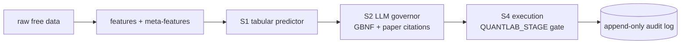
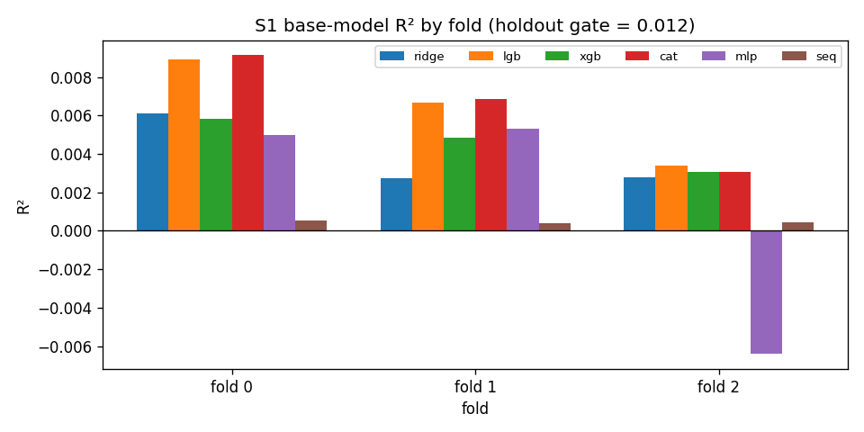
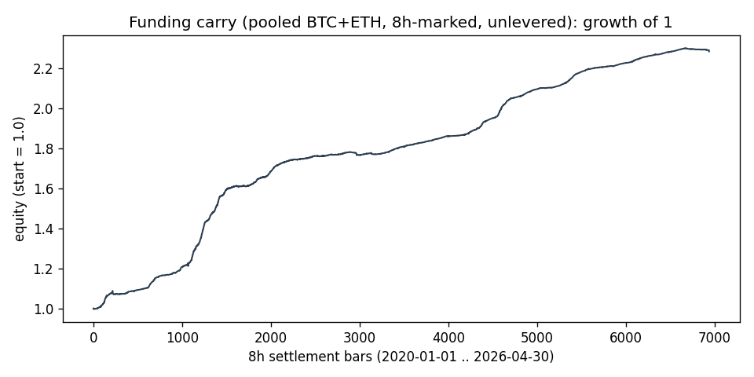
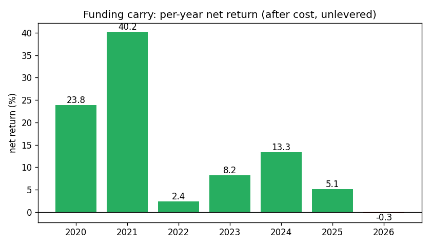
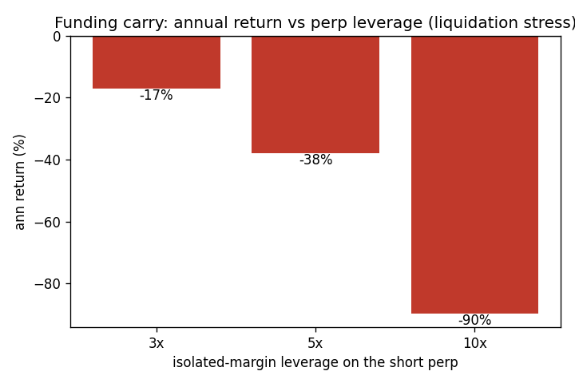
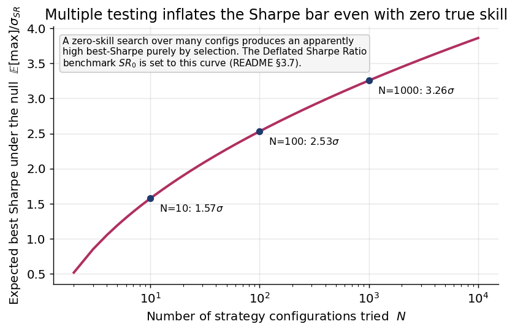
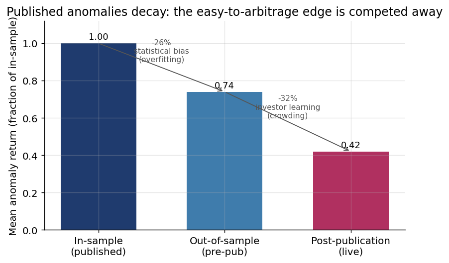
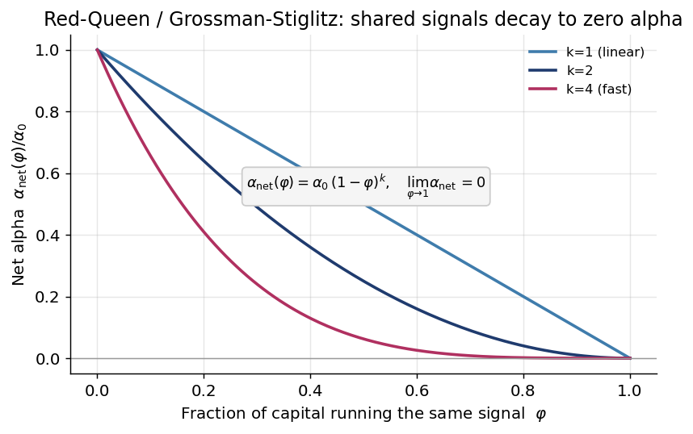
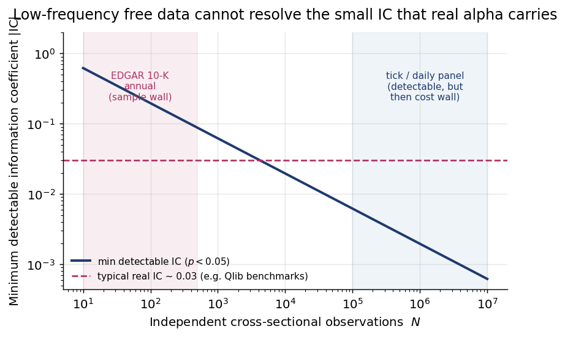

# QuantLab Alpha — A Negative-Results Study in Zero-Cost Quantitative Alpha

[](docs/runbooks/stage_promotion.md)
[](docs/runbooks/kill_switch.md)
[](#7-reproducibility)
[-lightgrey)](#8-limitations--honest-disclosures)

> **Honest headline.** This program produced **0 deployable, 0 paper, and 0 live
> strategies.** That is not the failure of the project — it *is* the result. The
> deliverable is (1) a rigorous, leakage-safe validation harness and (2) the
> reproducible, documented map of *which data changes the answer*. Under a strict
> zero-cost data constraint, no taker-tradable alpha survived out-of-sample
> validation. The binding constraint is the **information set**, not the method.

---

## Abstract

QuantLab Alpha is a local-first, stage-gated alpha research platform for a single
operator on commodity Apple-Silicon hardware. Its architecture is four staged
subsystems: an **S1 tabular predictor**, an **S2 LLM governor** that vetoes signals
not supported by a local research corpus, **S3 free-data feeds and broker
abstractions**, and **S4 promotion-gated execution** with a file-based kill switch and
an append-only, byte-for-byte replayable audit log. The platform's delivered
scientific contribution is *not* a profitable strategy. It is a reproducible
validation harness — purged/embargoed cross-validation, weighted zero-mean R²,
adversarial feature validation, a seeded noise floor, probability of backtest
overfitting, deflated Sharpe ratios, and stationary-bootstrap confidence intervals —
together with the honest finding that **under a zero-cost data constraint no
taker-tradable alpha survives out-of-sample validation**. Across an S1 tabular
predictor and roughly thirteen closed signal-research branches culminating in a
delta-neutral funding-carry capstone, the binding constraint is shown to be the
information set, not the modelling method. We further show (§6) that this conclusion is
*predicted* by four independent strands of the literature — post-publication anomaly
decay, backtest-overfitting theory, the Grossman–Stiglitz/Berk–Green equilibrium, and
the empirical failure of crowdsourced retail alpha — and that no public quantitative
system survives the same validation gate. This repository is **research-only**: it
reports **0 deployable strategies** and authorizes no paper or live trading.

---

## 1. Introduction

The problem is the standard one stated honestly: can a single operator, using only
free or self-authenticated data and local compute, build something that survives
hedge-fund-grade out-of-sample validation? Most retail "alpha" evaporates the moment
transaction costs, survivorship bias, and overfitting controls are applied. The
contribution of this work is to apply those controls rigorously, document every
failure, and isolate *why* each one fails.

The platform rests on a **two-layer thesis**: numeric prediction and evidence-based
governance should be orthogonal responsibilities.

1. **S1** is the only authoritative source of numeric forecasts. It produces a
   prediction and a confidence; it never decides to trade.
2. **S2** is an LLM governor that may only *veto* or *explain*. Every `pass` verdict
   must cite at least one chunk of the local research corpus or be downgraded to
   `insufficient_evidence`. The governor never originates a trade.

This separation gives four concrete research questions.

| ID | Research question | Repository evidence |
|---|---|---|
| RQ1 | Can leakage-safe tabular models clear a pre-registered weighted zero-mean R² gate on Jane-Street-style targets? | [`src/quant_research_stack/alpha/`](src/quant_research_stack/alpha/), [`docs/research/VALIDATION_RUNBOOK.md`](docs/research/VALIDATION_RUNBOOK.md) |
| RQ2 | Do candidate features survive adversarial validation and a seeded random-noise floor? | [`alpha/adversarial.py`](src/quant_research_stack/alpha/adversarial.py), [`alpha/metrics.py`](src/quant_research_stack/alpha/metrics.py) |
| RQ3 | Can an LLM governor veto unsupported trades while being forced to cite local research chunks? | [`src/quant_research_stack/governor/`](src/quant_research_stack/governor/), [ADR 0005](docs/architecture/adrs/0005-llm-governor-citation-requirement.md) |
| RQ4 | Can staged promotion prevent accidental live trading before paper/shadow evidence exists? | [`docs/runbooks/`](docs/runbooks/), [ADR 0002](docs/architecture/adrs/0002-three-stage-promotion-gate.md) |

The answer to RQ1 is **no, not under free data** (S1 sits below its gate). RQ2–RQ4 are
answered affirmatively as *infrastructure*: the controls work and they correctly
reject fragile results. The remainder of this paper is the evidence.

---

## 2. Platform Architecture



**Stage gating.** A single operator-controlled environment variable,
`QUANTLAB_STAGE`, selects the broker class loaded at process start: `paper`
(simulated brokers), `live_shadow` (read-only real account routed to a null broker),
or `live` (real money). In-process self-promotion is forbidden by design — promotion
requires a signed runbook commit, an edited `.env`, and a process restart
([ADR 0002](docs/architecture/adrs/0002-three-stage-promotion-gate.md),
[stage promotion runbook](docs/runbooks/stage_promotion.md)).

**Kill-switch precedence.** A `KILL_TRADING` file in the repository root, a stale
model, a data outage, or a drawdown breach halts trading; the kill path takes
precedence over every other decision in S4
([ADR 0014](docs/architecture/adrs/0014-kill-switch-precedence.md),
[kill switch runbook](docs/runbooks/kill_switch.md)).

**Audit and replay.** Every S2/S3/S4 decision lands in an append-only JSONL audit log.
Each rotation is made read-only after closing, and replay of the log must reproduce the
same decision sequence byte-for-byte. The full design rationale is in the
[platform design spec](docs/superpowers/specs/2026-05-14-quantlab-alpha-platform-design.md)
and the two-tier separation in
[ADR 0001](docs/architecture/adrs/0001-two-tier-tabular-llm.md).

---

## 3. Machine-Learning Methodology

The harness is the deliverable, so the methodology section is precise. Each control
links to the module that implements it and to the
[validation runbook](docs/research/VALIDATION_RUNBOOK.md).

### 3.1 Purged & embargoed walk-forward / CPCV

Implemented in [`alpha/cv.py`](src/quant_research_stack/alpha/cv.py). For fold $j$ the
validation dates form an interval $V_j = [a_j, b_j]$. With purge length $p$ and embargo
length $e$, a training date $d$ is admissible only if

$$d < a_j - p \quad \vee \quad d > b_j + e.$$

**Purging** removes training rows whose label horizon overlaps the validation window
(so a label observed in training does not depend on a price realized inside the
validation set). The **embargo** additionally drops a buffer of rows immediately after
each validation block, blocking serial-correlation leakage across the split. Combinatorial
purged cross-validation (CPCV) generalizes this to multiple held-out groups so the
overfitting estimate (§3.6) sees many train/test recombinations (López de Prado, 2018).

### 3.2 Weighted zero-mean R²

Implemented in [`alpha/metrics.py`](src/quant_research_stack/alpha/metrics.py). The
Jane-Street-style score is

$$R^2_{w}=1-\frac{\sum_i w_i (y_i-\hat y_i)^2}{\sum_i w_i y_i^2}.$$

The denominator is taken about **zero**, not about the sample mean. A score above zero
means the model beats the naive "predict zero return" baseline; the metric **can be
negative** when a model is worse than that baseline — which several S1 base learners
are on the holdout (§4.1).

### 3.3 Adversarial validation

Implemented in
[`alpha/adversarial.py`](src/quant_research_stack/alpha/adversarial.py). A classifier is
trained to distinguish train rows from holdout rows on a per-feature basis. Any feature
whose train-vs-holdout classifier **AUC > 0.6** is dropped or transformed, because such
a feature carries a regime shift the model would exploit in-sample and lose on the
holdout.

### 3.4 Noise-floor control

A seeded Gaussian feature $\eta_i \sim N(0,1)$ is injected into every training run. Any
engineered feature ranked **below** that pure-noise feature in $\ge 3$ of $5$ folds is
removed. This is a direct, brutal test: a real signal must beat random noise on a stable
majority of folds or it does not enter the model.

### 3.5 Stacking meta-learner

Implemented in [`alpha/stacking.py`](src/quant_research_stack/alpha/stacking.py). Let
$Z$ be the matrix of **out-of-fold** base-model predictions. A non-negative ridge
meta-model solves

$$\hat a = \arg\min_{a}\Big[\sum_i w_i\,(y_i - Z_i a)^2 + \alpha\sum_j a_j^2\Big],\qquad a_j \ge 0,$$

and the stacked forecast is $\hat y_i^{\,\text{stack}} = \sum_j \hat a_j\,\hat y_{i,j}$.
Using only out-of-fold predictions prevents the meta-learner from seeing any base model's
in-sample fit, so the blend introduces no leakage; the non-negativity constraint forbids
a base learner from entering with a perverse negative sign.

### 3.6 Probability of Backtest Overfitting (CSCV)

Implemented in
[`crypto_research/perps/validation.py`](src/quant_research_stack/crypto_research/perps/validation.py).
Combinatorially symmetric cross-validation (CSCV; Bailey, Borwein, López de Prado &
Zhu, 2017) splits performance into many train/test pairs, ranks the in-sample best
configuration, and measures how often it underperforms out of sample. With $\bar r$ the
out-of-sample rank of the in-sample winner,

$$\mathrm{PBO}=\Pr\!\big[\operatorname{logit}(\bar r)\le 0\big].$$

A high PBO means the apparent best strategy is most likely an artifact of selection over
many trials.

### 3.7 Deflated Sharpe Ratio

Also in
[`crypto_research/perps/validation.py`](src/quant_research_stack/crypto_research/perps/validation.py).
The deflated Sharpe ratio corrects a measured Sharpe $\hat{SR}$ for non-normality and
for the number of trials,

$$\widehat{\mathrm{DSR}}=\Phi\!\left(\frac{(\hat{SR}-SR_0)\sqrt{T-1}}{\sqrt{1-\gamma_3\hat{SR}+\frac{\gamma_4-1}{4}\hat{SR}^2}}\right),$$

where $\gamma_3,\gamma_4$ are the skew and kurtosis of returns and the benchmark
threshold $SR_0$ is **inflated for the number of strategies tried** (Bailey & López de
Prado, 2014; see §6.1 for the closed form). A strategy passes only if its Sharpe
survives this inflation.

### 3.8 Stationary-bootstrap Sharpe CI

A stationary bootstrap (Politis & Romano, 1994) resamples blocks of returns (preserving
serial dependence) to build a confidence interval on the Sharpe ratio. The pre-registered gate
requires the **lower bound of the CI to be strictly positive** — a point estimate is not
enough.

### 3.9 Funding-carry identity and liquidation model

Implemented in
[`crypto_research/funding/carry.py`](src/quant_research_stack/crypto_research/funding/carry.py).
For a delta-neutral long-spot / short-perp position, the per-period net return decomposes
as

$$r_t=\big(r^{\text{spot}}_t-r^{\text{perp}}_t\big)+f_t-c_t,$$

where $r^{\text{spot}}_t-r^{\text{perp}}_t$ is the basis change, $f_t$ is the funding
the short **receives** when funding is positive, and $c_t$ is transaction plus hedge cost.
Because the spot leg fully collateralizes the short, capital efficiency requires leverage,
which introduces an **isolated-margin liquidation** risk on the short perp: an adverse
intrabar basis move that exhausts posted margin forces liquidation and loss of that
margin. This tail, not the daily volatility, is what kills the strategy (§4.3).

---

## 4. Experimental Results

### 4.1 S1 tabular predictor

The latest S1 run (`experiments/alpha_s1/20260523-160541`) was trained on
**4,011,392** rows and evaluated on a permanent **1,008,656**-row holdout with **3 CV
folds**, on **79** features surviving adversarial (§3.3) and noise-floor (§3.4)
filtering. The pre-registered milestone gate is **holdout weighted zero-mean R² ≥
0.012**.



| Model | Holdout weighted zero-mean R² |
|---|---:|
| CatBoost | **+0.0062** |
| Ridge | +0.0039 |
| LightGBM | +0.0025 |
| Sequence (1D-CNN) | −0.0007 |
| XGBoost | −0.0093 |
| MLP | −0.0094 |
| **Ensemble (holdout)** | **+0.0055** |

**Verdict: below gate, not released.** The ensemble holdout score of **0.0055** is less
than half the **0.012** gate. Two base learners (XGBoost, MLP) are *negative* on the
holdout — worse than predicting zero. The trees and the linear baseline carry a faint,
real but sub-gate signal; nothing here is deployable. See the
[S1 implementation plan](docs/superpowers/plans/2026-05-14-quantlab-alpha-s1-implementation.md).

### 4.2 Signal-research ledger

Beyond S1, roughly thirteen independent signal-research branches were opened and closed.
Every one was killed by a documented mechanism — never by hand-waving. The verdicts
group into four recurring failure modes: **noise floor**, **subsumed by vol-targeting /
regime exposure**, **predictive-but-untradable** (markout below cost), and **data-blocked
/ survivorship-unsafe**.

| Branch | Verdict | Why it failed | Reference |
|---|---|---|---|
| OHLCV cross-sectional (6 iterations) | closed | noise floor; PSR/DSR kill the faint holdout flicker | [note](docs/research/2026-05-NEGATIVE-RESULT-OHLCV-ALPHA.md) |
| VRP index | closed | real but subsumed by HMM regime (orthogonal residual Sharpe ≈ 0) | [intake](docs/research/intake/2026-05-28-vrp-index-v1.md) |
| HMM single-index | closed | strong static fit but delay-sensitive and refit-unstable | [intake](docs/research/intake/2026-05-28-hmm-single-index-v1.md) |
| Event-macro FOMC | closed | real + placebo-clean but subsumed by vol-targeting; below gate | [note](docs/research/2026-05-NEGATIVE-RESULT-EVENT-MACRO-FOMC.md) |
| Microstructure L2 / L1 / tick | closed | predictive but untradable (markout < spread + fee) | [note](docs/research/2026-05-NEGATIVE-RESULT-MICROSTRUCTURE.md) |
| Futures carry / term-structure | rejected (data) | no native curve available for free | [intake](docs/research/intake/2026-05-30-futures-carry-term-structure-v1.md) |
| Options-IV cross-sectional | rejected (data) | only free return source is survivorship-biased | [intake](docs/research/intake/2026-05-30-options-iv-features-v1.md) |
| EDGAR 10-K text features | closed | clean (PIT + survivorship) but annual = too low-frequency | [intake](docs/research/intake/2026-05-30-edgar-10k-text-features-v1.md) |
| Zero-cost allocators v1 / v2 | DO_NOT_ADVANCE | cleared literal gate but crypto-regime-carried / ETH-concentrated and bootstrap-fragile | [intake](docs/research/intake/2026-05-30-zero-cost-deployable-v1.md) |

The full ledger, the four-wall taxonomy, and the consolidated arc are in the
[zero-cost alpha search close-out](docs/research/2026-05-ZERO-COST-ALPHA-SEARCH-CLOSEOUT.md)
and the
[signal-research program review](docs/research/2026-05-PROGRAM-REVIEW-SIGNAL-RESEARCH.md).
Outcome: **0 production, 0 paper, 0 live** candidates.

### 4.3 Funding-carry capstone

The freshest and most instructive result is a delta-neutral funding-rate carry: long
spot / short USDT-M perp on BTC + ETH, collecting the 8h funding that longs persistently
pay shorts, on free Binance Vision data over **2020-01..2026-04**. It was the first
branch to *structurally* escape the cost wall (it is held, not a taker bet) and the
subsumption wall (it is carry, not vol-timing), and the first to clear its data audits.



**Data audit — PASS.** 6,936 funding settlements; a 2,312-row/asset daily carry panel
with zero missing days; spot Vision-daily reconciled to on-disk 1-minute data to 0.0%.
Two bugs that *would have fabricated a result* were caught by the harness: an
exact-timestamp 8h join silently dropped ~45% of settlements (millisecond jitter in
`calc_time`), and a pooled book annualized 8h data at 365 instead of 1095. Both were
fixed and regression-tested.

**Backtest — net-positive in 6 of 7 years.** After 10 bps spot + 5 bps perp taker cost,
8h-marked pooled annual net returns were 2020 **+23.8%**, 2021 **+40.2%**, 2022
**+2.4%**, 2023 **+8.2%**, 2024 **+13.3%**, 2025 **+5.1%**, 2026 **−0.26%** (partial
year). The unlevered pooled Sharpe is ≈ **8.6** at ≈ **14%/yr**.



**The high Sharpe is real, not a marking illusion.** Re-marking the carry on the true
8h funding-settlement grid (rather than a smoothed daily close) did **not** deflate the
Sharpe: it moved 8.56 → 8.61. The spot-perp basis is genuinely tight even at 8h
resolution, so the figure is not a basis-variance artifact. The danger is elsewhere.



**The real risk is the fat left tail under leverage.** Unlevered, the carry is
capital-inefficient (100% margin on both legs). Any leverage used to fix that introduces
short-perp liquidation in crashes. Under an isolated-margin liquidation model the
stressed pooled returns are **3× → −17%/yr**, **5× → −38%/yr**, **10× → −90%/yr**. This
is a calm-period Sharpe that does not price its own tail — pennies in front of a
steamroller.

**Verdict: DO_NOT_ADVANCE.** It fails the pre-registered 2026 regime gate (2026 YTD net
−0.16% on the daily-close run; −0.26% 8h-marked) and the edge is decaying with crowding
(2024 +13% → 2025 +5% → 2026 ≈ 0). See the
[funding-carry negative result](docs/research/2026-05-NEGATIVE-RESULT-FUNDING-CARRY.md),
the [funding-carry intake](docs/research/intake/2026-05-30-funding-carry-v1.md), and the
[realism results](reports/signal_research/funding_carry_v1/funding_carry_realism_results.md).

---

## 5. Discussion — the Four Walls

Every failure in this program reduces to one or more of four walls. Only the last is a
methodology issue; the first three are data-access issues.

1. **Cost wall.** The signal is real but its markout is below realistic transaction cost
   (all microstructure channels).
2. **Subsumption wall.** A single-index risk-timing signal is already captured by
   vol-targeting or regime exposure, leaving ≈ 0 orthogonal residual (VRP, HMM, FOMC,
   the allocators' equity sleeves).
3. **Data-access / survivorship wall.** Structurally new channels need entitled or
   survivorship-safe data unavailable for free (futures curve, options-IV
   cross-section, 10-Q labels, point-in-time fundamentals).
4. **Frequency / sample wall.** Clean free data exists but at too low a frequency for
   robust inference (EDGAR 10-K annual: only a handful of holdout cross-sections).

The funding-carry capstone added a *fifth* pattern that does not reduce to these: a real,
free, market-neutral carry that is **regime-decaying and tail-dominated under the
leverage needed to make it efficient**.

**Meta-conclusion: data acquisition is the binding constraint.** Methodology and
validation are not the bottleneck — the controls work, and they repeatedly rejected
fragile results before they could mislead. What is missing is information the free tier
cannot supply. The full argument and the paid-data path are in the
[zero-cost alpha search close-out](docs/research/2026-05-ZERO-COST-ALPHA-SEARCH-CLOSEOUT.md),
the [zero-cost constraint note](docs/research/2026-05-30-ZERO-COST-CONSTRAINT.md), and the
[paid-data acquisition recommendation](docs/research/2026-05-30-PAID-DATA-ACQUISITION-RECOMMENDATION.md).

---

## 6. Related Work — The Public-Alpha Landscape and External Corroboration

A natural objection is that public repositories or published systems already achieve
what this program could not. A multi-source survey (companion report:
[`reports/2026-06-02-COMPETITIVE-LANDSCAPE-PUBLIC-QUANT.md`](reports/2026-06-02-COMPETITIVE-LANDSCAPE-PUBLIC-QUANT.md))
finds the opposite: **no public artifact contains a deployable, costed, capacity-aware,
gate-surviving alpha.** The visible ecosystem is *infrastructure* (backtest/execution
engines such as [NautilusTrader](https://nautilustrader.io/), backtrader, Zipline),
*research pipelines* ([Microsoft Qlib](https://github.com/microsoft/qlib); Yang et al.,
2020, whose published benchmarks report ranking ICs of $\approx 0.03\text{–}0.05$ —
**not** net-of-cost PnL), *education* (RSI/MACD/pairs cookbooks), or *unaudited,
self-reported* metrics
(the 2025–26 LLM-agent wave). None publishes the costed, purged-and-embargoed,
PBO/DSR-gated holdout that §3 mandates.

This section formalizes *why* — and shows that four independent strands of the academic
and industry record reproduce this program's four-wall thesis (§5). Each subsection pairs
a closed-form model with the wall it explains; all figures are regenerated by
[`scripts/make_landscape_figures.py`](scripts/make_landscape_figures.py) from the
equations alone (no market data), so they are fully reproducible.

### 6.1 Selection bias: why a "successful" public backtest is usually the best of many nulls

Let $N$ candidate configurations be evaluated against the same history, each with a
Sharpe estimate $\widehat{SR}_n$. Even when **every** strategy has *zero* true skill
($SR=0$), the *maximum* sampled Sharpe grows without bound in $N$. For estimates with
cross-trial standard deviation $\sigma_{SR}$, the Bailey–López de Prado expected maximum is

$$
SR_0 \;=\; \mathbb{E}\!\left[\max_{1\le n\le N}\widehat{SR}_n\right]
\;\approx\;
\sigma_{SR}\left[(1-\gamma)\,\Phi^{-1}\!\Big(1-\tfrac{1}{N}\Big)
\;+\;\gamma\,\Phi^{-1}\!\Big(1-\tfrac{1}{N\,e}\Big)\right],
$$

where $\gamma\approx 0.5772$ is the Euler–Mascheroni constant and $\Phi^{-1}$ is the
standard-normal quantile function. The Deflated Sharpe Ratio (§3.7) sets its benchmark to
exactly this $SR_0$, so a strategy "passes" only if it beats the best a zero-skill search
would have produced by chance.



The practical consequence: with $\approx 45$ variants on five years of daily data, the
probability that the best backtest is overfit already exceeds $50\%$ (Bailey, Borwein,
López de Prado & Zhu, 2017). The proliferation of >300 published "factors" is itself a
multiple-testing artifact (Harvey, Liu & Zhu, 2016). Public cookbooks and AutoML/LLM
factor-miners report the *top* configuration **without deflation**; this program reports
the deflated, multiple-testing-aware number — which is why their curves look like alpha
and ours look like a closed channel.

### 6.2 Decay: published, liquid signals are competed to zero (cost & subsumption walls)

McLean & Pontiff (2016) tracked 97 cross-sectional predictors from publication into live
markets. Decomposing the in-sample return $r_{\text{IS}}$ into a statistical-bias
component (overfitting, revealed out-of-sample) and an investor-learning component
(crowding, revealed post-publication):

$$
r_{\text{post}}
\;\approx\;
r_{\text{IS}}-\big(\underbrace{0.26}_{\text{overfitting}}+\underbrace{0.32}_{\text{crowding}}\big)\,r_{\text{IS}}
\;=\;0.42\,r_{\text{IS}},
$$

i.e. roughly a quarter of the edge was never real and a further third is arbitraged away
once the signal is public (McLean & Pontiff, 2016). Critically, the **liquid,
easy-to-arbitrage** anomalies — precisely those tradable from free OHLCV — decay the
*most*, exactly as the limits-of-arbitrage view predicts (Shleifer & Vishny, 1997).



The crowding limit is the Grossman–Stiglitz / "Red-Queen" equilibrium: if a fraction
$\varphi$ of capital runs the same signal, net alpha decays as

$$
\alpha_{\text{net}}(\varphi)=\alpha_0\,(1-\varphi)^{k},\qquad k\ge 1,\qquad
\lim_{\varphi\to 1}\alpha_{\text{net}}(\varphi)=0,
$$

is the Grossman–Stiglitz impossibility result (Grossman & Stiglitz, 1980) and Lo's
adaptive-markets view of strategy proliferation and decay (Lo, 2004); LLM-assisted
research drives $\varphi\to 1$ faster by homogenizing the candidate set
([arXiv:2605.23905](https://arxiv.org/html/2605.23905), 2026). This is the program's
**subsumption wall** in closed form: a public, liquid, easily-described signal is, by
construction, near the end of its half-life.



### 6.3 Detectability: free low-frequency data cannot resolve real-sized IC (sample wall)

The standard error of a cross-sectional information coefficient over $N$ independent
observations is $\operatorname{SE}(\widehat{\operatorname{IC}})\approx N^{-1/2}$, so its
$t$-statistic is $t=\widehat{\operatorname{IC}}\,\sqrt{N}$. The smallest IC distinguishable
from zero at significance $\alpha$ is therefore

$$
\operatorname{IC}_{\min}(N)=\frac{z_{1-\alpha/2}}{\sqrt{N}}.
$$

A *real* cross-sectional IC is small — Qlib's published benchmarks sit at
$\operatorname{IC}\approx 0.03$. Resolving it at $p<0.05$ needs
$N\ge (1.96/0.03)^2\approx 4.3\times 10^{3}$ independent cross-sections. EDGAR 10-K annual
panels supply $N$ in the low hundreds at most — **structurally undetectable**, regardless
of method. Tick/daily panels supply $N$ large enough to detect it, but those signals then
hit the cost wall (§6.4).



### 6.4 The cost wall, formally

Let a signal have gross information ratio $\widehat{IR}_{\text{gross}}$, per-period
turnover $\tau$, round-trip cost $c$ (spread + fee + impact), and per-period return
volatility $\sigma_r$. The cost-adjusted information ratio is

$$
\widehat{IR}_{\text{net}}
=\widehat{IR}_{\text{gross}}-\frac{\tau\,c}{\sigma_r}.
$$

When the per-trade **markout is below $c$**, $\widehat{IR}_{\text{net}}<0$ for *any*
$\widehat{IR}_{\text{gross}}$. This is exactly the microstructure outcome in §4.2: a
genuine gross IC of $0.45$ on tick trade-flow that is nonetheless untradable once the
bid–ask bounce and fee are paid. The surviving public edge hides where $c$ is largest
(illiquid names), which is the worst place for a free-data taker.

### 6.5 The capacity wall (why the retail micro-cap edge does not scale)

The Berk–Green (2004) rational-markets mechanism implies decreasing returns to scale:
alpha net of price impact falls in deployed capital $C$,

$$
\alpha_{\text{net}}(C)=\alpha_0-\kappa\,C^{\beta},\qquad \beta\ge \tfrac12,
$$

so a capacity-constrained anomaly a small operator *can* access (micro-caps) has an
optimal size $C^\star$ too small to support a fund, while the strategies that *do* scale
have $\alpha_0$ already arbitraged. Quantopian's collapse is this inequality made
concrete: free survivorship-safe minute data and hundreds of thousands of researchers
still failed to yield *scalable* alpha, because — in the widely-reported post-mortem —
*"the idea is only 10%; execution, risk, portfolio construction and transaction-cost
analysis are the 90%"* (industry post-mortem, BrokersDB, 2026).

### 6.6 Synthesis: public "success" and our "0 deployable" are the same fact

| Quantity reported | Public repos / cookbooks | This program |
|---|---|---|
| Sharpe | gross, **un-deflated**, best-of-$N$ ($\approx SR_0$ inflation) | net, deflated against $SR_0$ |
| Sample | in-sample / favourable window | purged-embargoed OOS holdout |
| Costs | often omitted | $\tau c/\sigma_r$ subtracted (§6.4) |
| Capacity | ignored | required (§6.5) |
| Decay | unmodelled | $(1-\varphi)^k$ crowding assumed (§6.2) |

Reading the same market through stricter instruments yields a stricter — and more
honest — number. The external record (anomaly decay, backtest-overfitting theory,
Quantopian, pod-shop practice, LLM homogenization) does not contradict this program's
result; it **predicts** it. The corollary stands: **the binding constraint is the
information set, not the method** — the genuine winners win on entitled data, execution
infrastructure, capacity-constrained niches, and portfolio construction across many
*decayed* sleeves, none of which a free-data solo operator can manufacture from a better
model.

---

## 7. Reproducibility

The capstone result regenerates in seconds from cached free data:

```bash
make mvp
```

`make mvp` runs the funding-carry v1 pipeline, the realism (8h-marked + liquidation)
pass, and regenerates the four figures embedded above (`figures/*.png`). It prints the
honest verdict — `funding-carry = DO_NOT_ADVANCE (research_only)` — and writes reports to
`reports/signal_research/funding_carry_v1/`.

**Environment.** Dependencies are managed with `uv`; all entry points run with
`PYTHONPATH=src`.

```bash
uv sync --extra dev
PYTHONPATH=src uv run pytest -q
ruff check src scripts tests
mypy src
```

**Artifact integrity.** Every S1 artifact is hashed under
[`experiments/alpha_s1/20260523-160541/_artifact_sha256.json`](experiments/alpha_s1/20260523-160541/_artifact_sha256.json),
so a clean checkout can verify byte-for-byte that the reported numbers come from the
committed models. **Audit replay**: replaying the append-only audit log must reproduce
the same decision sequence byte-for-byte (§2).

---

## 8. Limitations & honest disclosures

- **No deployable alpha exists.** 0 deployable, 0 paper, 0 live strategies. Nothing in
  this repository is authorized for paper or live trading, and no result here constitutes
  investment advice.
- **S1 is below its gate.** Holdout weighted zero-mean R² of 0.0055 vs a 0.012 gate; two
  base learners are negative on the holdout.
- **The funding carry is tail-dominated and decaying.** Its high Sharpe is a calm-regime
  figure; under the leverage needed for capital efficiency it carries a crash-liquidation
  tail (−17%/−38%/−90% at 3×/5×/10×), and it fails the pre-registered 2026 regime gate as
  the edge crowds out.
- **Free-data scope.** Sub-millisecond equity HFT, native futures curves, true options
  chains, and survivorship-safe equity fundamentals are all out of scope on free tiers.
- **What would change the answer.** Paid, survivorship-safe data (e.g. Sharadar) would
  reopen the data-blocked branches; the dormant ingestion scaffold is ready. The
  feasibility analysis and kill criteria are in the
  [Sharadar data-purchase feasibility study](docs/research/2026-05-DATA-PURCHASE-FEASIBILITY-SHARADAR.md).

---

## 9. References & repository map

**Architecture Decision Records** — [`docs/architecture/adrs/`](docs/architecture/adrs/)
- [ADR 0001 — two-tier tabular / LLM separation](docs/architecture/adrs/0001-two-tier-tabular-llm.md)
- [ADR 0002 — three-stage promotion gate](docs/architecture/adrs/0002-three-stage-promotion-gate.md)
- [ADR 0003 — GBNF-constrained LLM output](docs/architecture/adrs/0003-gbnf-constrained-llm-output.md)
- [ADR 0005 — LLM governor citation requirement](docs/architecture/adrs/0005-llm-governor-citation-requirement.md)
- [ADR 0010 — fill model and fixed-bps slippage](docs/architecture/adrs/0010-fill-model-and-fixed-bps-slippage.md)
- [ADR 0014 — kill-switch precedence](docs/architecture/adrs/0014-kill-switch-precedence.md)

**Specs** — [`docs/superpowers/specs/`](docs/superpowers/specs/)
- [Platform design](docs/superpowers/specs/2026-05-14-quantlab-alpha-platform-design.md)
- [S2 governor design](docs/superpowers/specs/2026-05-16-quantlab-alpha-s2-governor-design.md)
- [Crypto-perp microstructure design](docs/superpowers/specs/2026-05-26-crypto-perp-microstructure-design.md)

**Plans** — [`docs/superpowers/plans/`](docs/superpowers/plans/)
- [S1 implementation plan](docs/superpowers/plans/2026-05-14-quantlab-alpha-s1-implementation.md)
- [Crypto strategy research loop](docs/superpowers/plans/2026-05-25-crypto-strategy-research-loop.md)
- [MVP README deliverable](docs/superpowers/plans/2026-05-30-mvp-readme-deliverable.md)

**Negative-result notes** — [`docs/research/`](docs/research/)
- [OHLCV cross-sectional alpha](docs/research/2026-05-NEGATIVE-RESULT-OHLCV-ALPHA.md)
- [Event-macro FOMC](docs/research/2026-05-NEGATIVE-RESULT-EVENT-MACRO-FOMC.md)
- [Microstructure L2/L1/tick](docs/research/2026-05-NEGATIVE-RESULT-MICROSTRUCTURE.md)
- [Funding-carry capstone](docs/research/2026-05-NEGATIVE-RESULT-FUNDING-CARRY.md)
- [Zero-cost alpha search close-out](docs/research/2026-05-ZERO-COST-ALPHA-SEARCH-CLOSEOUT.md)
- [Signal-research program review](docs/research/2026-05-PROGRAM-REVIEW-SIGNAL-RESEARCH.md)

**Research intakes** — [`docs/research/intake/`](docs/research/intake/)
- [VRP index v1](docs/research/intake/2026-05-28-vrp-index-v1.md)
- [HMM single-index v1](docs/research/intake/2026-05-28-hmm-single-index-v1.md)
- [Funding-carry v1](docs/research/intake/2026-05-30-funding-carry-v1.md)
- [Futures carry / term-structure v1](docs/research/intake/2026-05-30-futures-carry-term-structure-v1.md)
- [Options-IV features v1](docs/research/intake/2026-05-30-options-iv-features-v1.md)
- [EDGAR 10-K text features v1](docs/research/intake/2026-05-30-edgar-10k-text-features-v1.md)
- [Zero-cost deployable v1](docs/research/intake/2026-05-30-zero-cost-deployable-v1.md)

**Runbooks** — [`docs/runbooks/`](docs/runbooks/)
- [Stage promotion](docs/runbooks/stage_promotion.md)
- [Kill switch](docs/runbooks/kill_switch.md)
- [Paper validation methodology](docs/runbooks/paper_validation_methodology.md)

**Program reports** — [`reports/`](reports/)
- [Program review — the data-entitlement constraint](reports/2026-05-30-PROGRAM-REVIEW-DATA-CONSTRAINT.md)
- [Competitive landscape — public & published quant systems](reports/2026-06-02-COMPETITIVE-LANDSCAPE-PUBLIC-QUANT.md) (basis of §6)

### Academic references (§3 methodology, §6 corroboration)

Cited in author–year form throughout §3 and §6.

- Bailey, D. H., Borwein, J. M., López de Prado, M., & Zhu, Q. J. (2017). The Probability of Backtest Overfitting. *Journal of Computational Finance*, 20(4), 39–69. https://doi.org/10.21314/JCF.2016.322
- Bailey, D. H., & López de Prado, M. (2014). The Deflated Sharpe Ratio: Correcting for Selection Bias, Backtest Overfitting, and Non-Normality. *Journal of Portfolio Management*, 40(5), 94–107. https://doi.org/10.3905/jpm.2014.40.5.094
- Berk, J. B., & Green, R. C. (2004). Mutual Fund Flows and Performance in Rational Markets. *Journal of Political Economy*, 112(6), 1269–1295. https://doi.org/10.1086/424739
- Grossman, S. J., & Stiglitz, J. E. (1980). On the Impossibility of Informationally Efficient Markets. *American Economic Review*, 70(3), 393–408.
- Harvey, C. R., Liu, Y., & Zhu, H. (2016). … and the Cross-Section of Expected Returns. *Review of Financial Studies*, 29(1), 5–68. https://doi.org/10.1093/rfs/hhv059
- Lo, A. W. (2004). The Adaptive Markets Hypothesis. *Journal of Portfolio Management*, 30(5), 15–29.
- López de Prado, M. (2018). *Advances in Financial Machine Learning*. Hoboken, NJ: Wiley. (purged/embargoed CV, CPCV — §3.1, §3.6)
- McLean, R. D., & Pontiff, J. (2016). Does Academic Research Destroy Stock Return Predictability? *Journal of Finance*, 71(1), 5–32. https://doi.org/10.1111/jofi.12365
- Politis, D. N., & Romano, J. P. (1994). The Stationary Bootstrap. *Journal of the American Statistical Association*, 89(428), 1303–1313. https://doi.org/10.1080/01621459.1994.10476870
- Shleifer, A., & Vishny, R. W. (1997). The Limits of Arbitrage. *Journal of Finance*, 52(1), 35–55. https://doi.org/10.1111/j.1540-6261.1997.tb03807.x
- Yang, X., Liu, W., Zhou, D., Bian, J., & Liu, T.-Y. (2020). Qlib: An AI-oriented Quantitative Investment Platform. *arXiv:2009.11189*. https://arxiv.org/abs/2009.11189

### Secondary & industry sources (§6 background)

Non-peer-reviewed; used for industry context and corroboration, not as primary evidence.

- AI-driven alpha decay under algorithmic monoculture — [arXiv:2605.23905](https://arxiv.org/html/2605.23905) (2026); [IBKR Quant: LLMs and the shortening shelf life of copyable alpha](https://www.interactivebrokers.com/campus/ibkr-quant-news/llms-and-the-shortening-shelf-life-of-copyable-alpha/).
- Backtest-bias surveys — [The three ways backtests lie](https://tesseraalpha.com/methodology/backtesting-survivorship-lookahead); [Backtest overfitting & live performance](https://quantalpha.co/en/blog/backtest-overfitting-and-live-performance).
- Crowdsourced-alpha & crowding case studies — [The rise and fall of Quantopian](https://brokersdb.com/learn/quantopian-history-legacy-review); [Factor decay & pod shops](https://youngandcalculated.substack.com/p/factor-decay-is-real-how-published).
- Platforms surveyed — [Microsoft Qlib](https://github.com/microsoft/qlib) · [NautilusTrader](https://nautilustrader.io/) · [awesome-systematic-trading](https://github.com/paperswithbacktest/awesome-systematic-trading).

---

## Legal disclaimer

This repository is not a regulated investment advisor and produces no investment advice.
It is a research system reporting a negative result. Real-money trading is gated behind
operator-only promotion controls and is solely the operator's responsibility.
