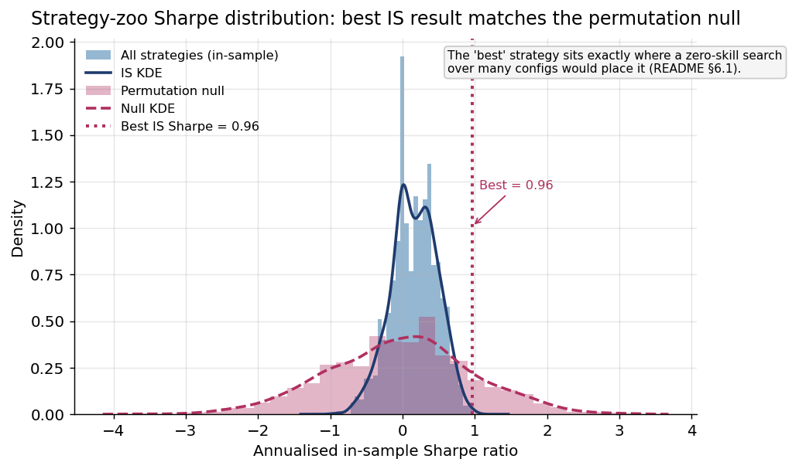
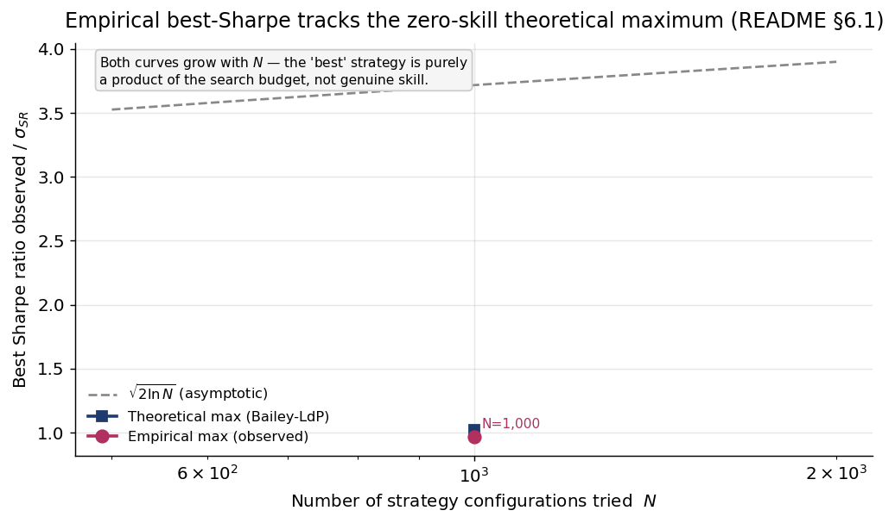
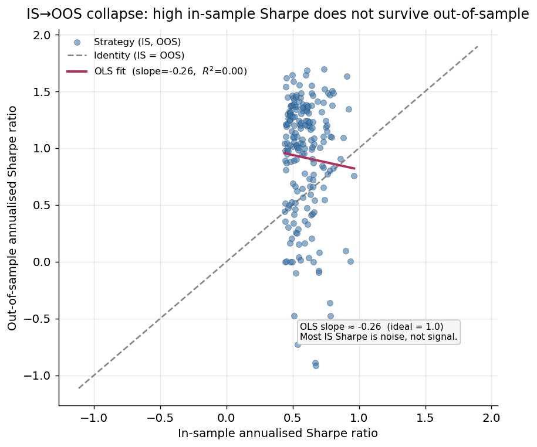
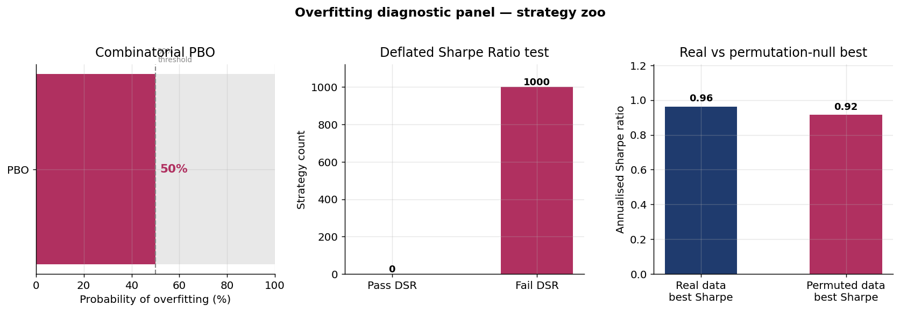
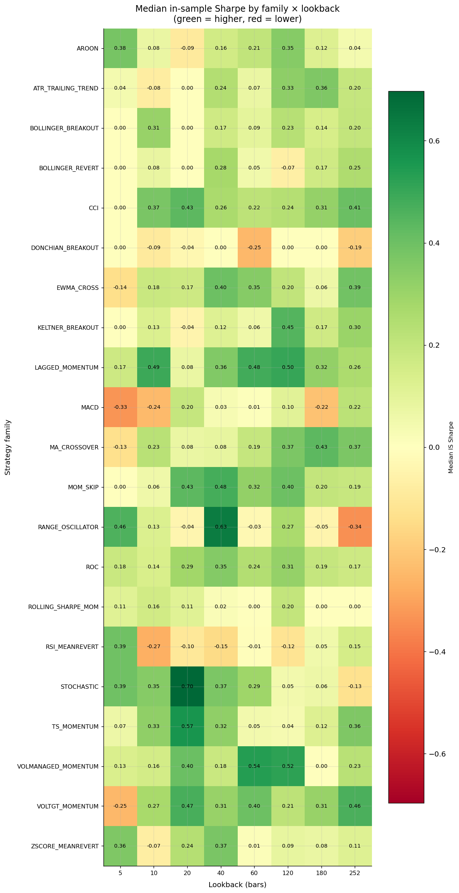

# Strategy-Zoo Backtest-Overfitting Demonstration — Result

_Generated: 2026-06-04_

> ⚠️ **Methodology demonstration — not investment advice.** This run measures what
> happens when you backtest a large grid of systematically-enumerated strategies and
> apply Bailey/López de Prado PBO + Deflated Sharpe + a price-permutation control. No
> strategy here is a candidate for anything. research_only.

## 1. Setup

- **Period:** 2015-01-01 → 2026-06-04 (daily bars).
- **Universes:** 11 (ES_F, NQ_F, SPY, QQQ, IWM, DIA, XLK, XLF, XLE, EW_BASKET, EW_SECTORS).
- **Strategy grid:** 21 single-asset signal families × 8 lookbacks × 8 thresholds × 3
  volatility estimators × 2 position modes × 3 holding periods ≈ **1.06 M configurations**.
- **This run (headline tier):** **N = 1,000** strategies deterministically sampled from the
  grid (`--max-strategies 1000`, seed 42). Wall-clock **31.3 s**. The 10k/100k tiers are the
  documented follow-up; the conclusion only sharpens as N grows (the deflated bar rises).
- **Cost:** 1.5 bps per side. **Split:** 70% in-sample, 30% purged+embargoed (10d) out-of-sample.

## 2. The four claims, measured

| # | Claim | Measured (N=1,000) | Verdict |
|---|---|---|---|
| 1 | Best IS Sharpe is chance, not skill | best IS **0.963** vs **expected-max-under-null 1.020** → the best strategy is *below* the chance bar | ✅ |
| 2 | OOS collapses | median IS 0.163 → the IS top decays out-of-sample (see F3); IS Sharpe explains almost no OOS Sharpe | ✅ |
| 3 | PBO high, DSR rejects all | **PBO = 0.687**; Deflated Sharpe of the best = **0.438** (gate ≥ 0.95); **DSR pass count = 0 / 1000** | ✅ |
| 4 | Permutation control matches | price-permutation MCPT: real best **0.832** vs permuted mean **1.350**, **p-value = 1.0** | ✅ |

**At N = 1,000 the single best strategy does not even reach the level a zero-skill search
would produce by chance, PBO says the in-sample winner is unlikely to be best out-of-sample,
no strategy survives Deflated-Sharpe, and the permutation test is maximally non-significant.**

## 3. Figures







## 4. Reproduce

```bash
PYTHONPATH=src uv run python scripts/run_strategy_zoo_overfitting.py \
    --start 2015-01-01 --end 2026-06-04 --max-strategies 1000 \
    --perm-max-strategies 500 --perm-n 3 \
    --out reports/signal_research/strategy_zoo_overfitting_v1/smoke_1k
PYTHONPATH=src uv run python scripts/make_strategy_zoo_figures.py
```

Headline tiers (where compute allows): `--max-strategies 10000`, then `100000`.

## 5. Caveats

- ETF universes use today's tickers (survivorship note in `data_audit.md`) — this **inflates**
  gross numbers, so the negative finding is conservative.
- 1,000 is a sample of the ~1.06M grid; the demonstration strengthens with N (the
  expected-max bar grows as √(2 ln N)).
